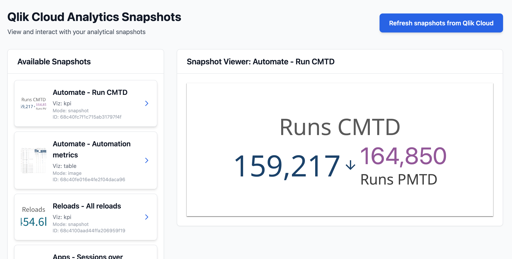

# Embed Qlik Cloud Analytics snapshots using qlik-embed

> **Important**  
> This solution documented in this repository is not production ready. The intent is to teach you how to use qlik-embed.

## Introduction

Imagine a situation where you need to show basic reporting and KPI information on a summary page of your web application. The solution doesn't require interactivity, but solving the problem with SQL and D3.js means writing a lot of code that can be difficult and time consuming to test and change. What if there is a way to easily serve Qlik Cloud Analytics snapshots of visualizations and data, enabling you to render summary resources without requiring users to log in? In this structured tutorial, you're going to learn how to render snapshot data to unauthenticated users using Qlik's qlik-embed web components, qlik/api, and OAuth machine-to-machine authentication capabilities.



## What you will learn

- **qlik-embed `analytics/snapshot`**: Load static chart snapshots without authentication
- **Automated snapshot retrieval**: Fetch the latest snapshots from Qlik Cloud using chart monitoring tasks
- **Local snapshot serving**: Serve previously downloaded snapshots for fast, offline access
- **Multiple display modes**: Support both image and interactive snapshot formats based on chart type

## Prerequisites

Before you begin, review the following articles to accelerate your path to success with absolute confidence.

- Using [qlik-embed](https://qlik.dev/embed/qlik-embed/)
- [Guiding principles for OAuth M2M authentication](https://qlik.dev/authenticate/oauth/oauth-m2m/).
- [Embed offline charts tutorial](https://qlik.dev/embed/qlik-embed/quickstart/qlik-embed-offline-charts-tutorial/).
- Use HTTPS rather than HTTP for your project.
- [Node.js](https://nodejs.org/) version 22 or higher
- An [OAuth M2M client](https://qlik.dev/authenticate/oauth/create/create-oauth-client/) configured with:
  - Scopes: `user_default`
  - No specific allowed origins required (server-side authentication)

## Step 1. Set up your local project

### Method 1: Clone the GitHub repository

Clone the GitHub repository using the `git clone` command.

```bash
git clone https://github.com/qlik-oss/qlik-cloud-embed-snapshot.git
```

### Method 2: Download and extract the project files

Alternatively, you can download and extract the project files.

1. On the project's [GitHub page](https://github.com/qlik-oss/qlik-cloud-embed-snapshot), click **Code**.
2. Select **Download ZIP**.
3. Extract the content of the ZIP file in the folder of your choice.

## Step 2. Set up chart monitoring tasks in Qlik Cloud

Before running this application, you need to add at least one monitored chart to a space that the OAuth client bot user can access:

1. [Monitor a chart from a Qlik Sense app](https://help.qlik.com/en-US/cloud-services/Subsystems/Hub/Content/Sense_Hub/Hub/monitor-charts-hub.htm), and place into a space.
2. Add the OAuth client's bot user to the relevant space with `Can view` or greater permissions.

> **Note**  
> Chart monitoring tasks must be properly configured and executed at least once before the application can retrieve snapshot data.

## Step 3. Set up environment variables

1. Rename the `template.env` file to `.env`.
2. Edit the `.env` file with values that match your Qlik Cloud deployment:
   • `QLIK_M2M_CLIENT_ID`: enter the client ID obtained when you created the OAuth M2M client in the Administration Console.
   • `QLIK_M2M_CLIENT_SECRET`: enter the client secret obtained when you created the OAuth M2M client in the Administration Console.
   
   > **Important**  
   > Keep these secrets safe as they provide access to your tenant.
   
   • `QLIK_TENANT_URL`: enter the hostname of the Qlik Cloud tenant against which the app will run, such as `z29kgagw312sl0g.eu.qlikcloud.com`.

## Step 4. Install the dependencies and run the app

1. Open a terminal window and navigate to the folder containing the project files you extracted or cloned.

   ```bash
   cd <project-folder>
   ```

2. Install the project dependencies.

   ```bash
   npm install
   ```

3. Start the server:

   ```bash
   npm start
   ```

4. Open [http://localhost:3000](http://localhost:3000/) in your browser.

You should see your web app running locally, displaying available snapshots from your Qlik Cloud tenant.

## How it works

The application operates in two modes:

### Fresh snapshot retrieval

When you click "Refresh snapshots from Qlik Cloud", the application:

1. Authenticates to Qlik Cloud using OAuth M2M credentials
2. Retrieves all configured chart monitoring tasks
3. Downloads the latest snapshot artifacts (images and interactive data)
4. Saves them locally in the `public/snapshots/` directory
5. Serves them to users without requiring authentication

### Local snapshot serving

The application also serves previously downloaded snapshots stored locally, allowing for:

- Fast loading times
- Offline access to snapshot data
- Reduced API calls to Qlik Cloud

### Display modes

Snapshots can be displayed in two modes:

- **Image mode**: Static PNG images for fast loading
- **Interactive mode**: Full qlik-embed snapshots with limited interactivity
